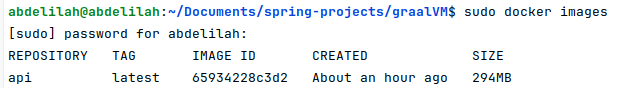

# Dockerizing a Native Image of a Spring Boot Application

This guide explains how to generate a native image of a Spring Boot application using Maven and then containerize it using Docker.

## Prerequisites
- Docker installed
- Maven installed (or you can use the wrapper `./mvnw`)
- GraalVM installed with the native-image tool

## Steps to Dockerize a Spring Boot Native Image

### 1. Generate the Native Image using Maven

To generate a native image of your Spring Boot application, run the following command:

```bash 
./mvnw -Pnative native:compile
```
### Alternatively, if you have Maven installed locally
```bash
 mvn -Pnative native:compile  
```

### Skip Tests (Optional)
```bash 
./mvnw -Pnative native:compile  -DskipTests
```
### For local Maven usage

```bash
 ./mvnw -Pnative native:compile -DskipTests
```

### Locate the Native Image

<h6>After the compilation is complete,
the generated native image will be in the target/ folder.
You can confirm its presence by checking the folder contents.</h6>


### Create a Dockerfile


### Build the Docker Image
```bash
Docker build -t nameOfImage .
```



### Run the Docker Container
```bash
docker run -p 8085:8080 nameOfImage
```


### Access the Application in a Browser


### Notes:

- This example uses Ubuntu to generate the native image.
- On Windows, if you generate the native image, it will have a `.exe` extension.
- If you are using Windows, you can also use Ubuntu via WSL2 to generate the native image.

### Accessing the Project from Windows Using WSL2

 If you're using Windows with WSL2 and want to generate the native image in a Linux environment (Ubuntu), you can access your project files from Windows through WSL2 by navigating to the Windows file system.

 Use the following command to access your project directory from within Ubuntu (WSL2):

```bash
cd /mnt/c/Users/<username>/<path-to-project>
or
cd /mnt/utilisateurs/<username>/<path-to-project> (french version)
```

Replace <username> with your Windows username and <path-to-project> with the correct path to your project directory.

Once you're in your project directory within WSL2, you can generate the native image the same way as you would on any Linux environment

